<p align="center">
  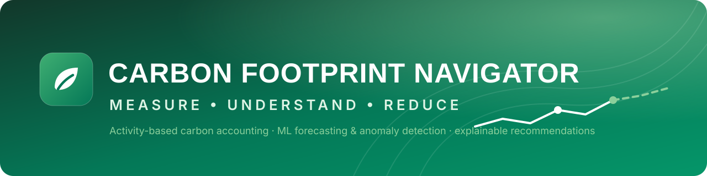
</p>

<h1 align="center">Carbon Footprint Navigator</h1>

<p align="center">
  AI-powered full-stack platform for measuring, tracking and reducing carbon emissions through activity-based carbon accounting,
  analytics, ML insights and personalised, explainable recommendations.
</p>

<p align="center">
  
  
  
  
  
  
  
  
</p>

<p align="center">
  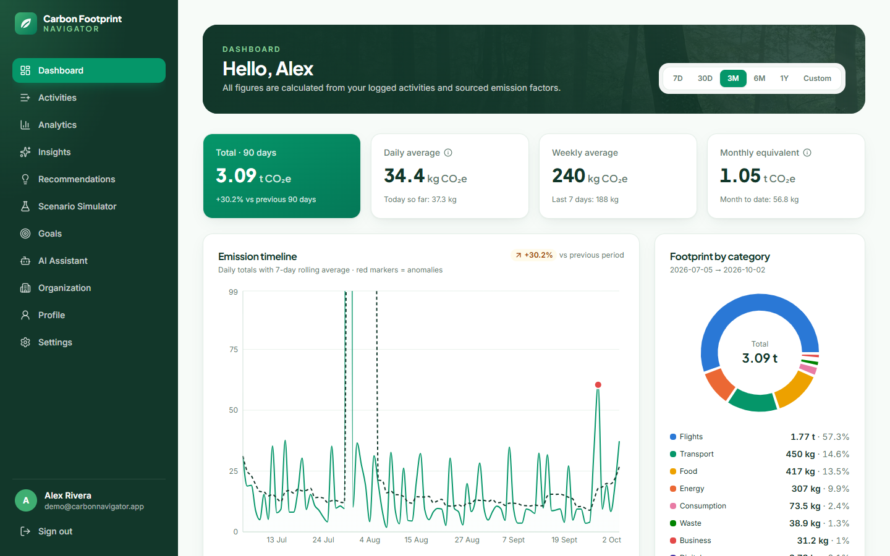
</p>

## Overview

Carbon Footprint Navigator turns everyday activities — journeys, flights, meter readings, meals, waste and purchases — into
**traceable CO₂e estimates**, then analyses them: trends, category contributions, **forecasts**, **anomaly detection**,
**explainable recommendations**, a **what-if scenario simulator**, **goals**, an **organisation mode** and a **sustainability
assistant** that explains your data without inventing numbers.

The core rule: **emissions are calculated deterministically** (quantity × sourced, versioned emission factor). Machine learning
is used for analysis, and a language model — when configured — only *explains* numbers the backend has already computed.

## Why Carbon Footprint Navigator?

* **Traceable, not a black box** — every record stores the factor id, value, unit, source, region, method string and assumptions
  (`42 mi x 1.6093 = 67.5924 km x 0.17 kg CO2e/km = 11.491 kg CO2e`).
* **Honest about uncertainty** — confidence levels per record, a public methodology page and the full factor dataset.
* **Quantified advice** — recommendations and scenarios recompute your behaviour with real factors; assumptions are spelled out.
* **Real engineering** — PostgreSQL with migrations, JWT auth with revocation, user isolation tests, CI, Docker, 83 automated tests (70 backend, 13 frontend).

## Key Features

| Area | What it does |
|---|---|
| Activity tracker | 18 activity types across transport, flights, energy, food, waste, consumption, digital, business and custom; live server-side CO₂e preview; flights from IATA codes |
| Carbon engine | 75 factors (DESNZ, EPA eGRID, Ember, IPCC, Poore & Nemecek, Scarborough et al., USEEIO); unit conversion; occupancy & passenger allocation; regional grid factors with fallback |
| Dashboard | Total, daily/weekly/monthly KPIs, previous-period comparison, category donut and stacked timeline, top activities, 1.5 °C benchmark — 7 days to 1 year or custom |
| Analytics | Trend with 7-day rolling mean and anomaly markers, monthly comparison, per-activity table, forecast with interval, goal progress |
| Forecasting | 3 models compete on a back-test; 7–90 day forecasts with 80% intervals and published metrics |
| Anomaly detection | Robust weekly z-scores per category + Isolation Forest on daily features |
| Recommendations | 15 quantitative rules, ranked by impact × difficulty, each with current behaviour, action, saving and calculation basis |
| Scenario simulator | 8 sliders (drive less, EV, fly less, electricity, renewables, heating, meat, recycling) recomputed by the backend in real time |
| Insights | Largest source, period change, biggest increase/improvement, anomalies, top opportunity, forecast trend, goal progress, data quality, benchmark |
| Goals & achievements | Reduction targets vs a monthly baseline with transparent measurement; 8 data-driven achievements |
| AI assistant | Context builder → LLM (Anthropic, optional) → numeric validation; deterministic, clearly labelled demo mode without a key |
| Organisation mode | Create/join with a code, log activities for the organisation, company dashboard and member contributions |
| Admin | Versioned emission-factor management with audit reason and history |

## Architecture

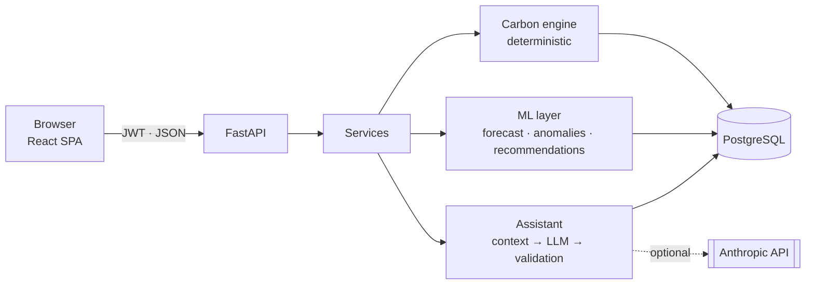

## System Architecture

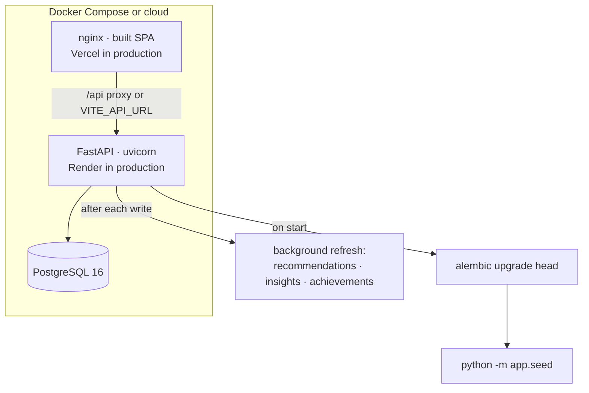

Details: [docs/architecture.md](docs/architecture.md).

## Carbon Calculation Engine

```
co2e_kg = normalized_quantity × factor_value
```

1. The activity catalogue classifies the input (e.g. `car` + `fuel_type=diesel` → `transport.car.diesel`) and validates its fields.
2. The active factor is loaded from the `emission_factors` table (country grid factor → GLOBAL fallback).
3. Units are converted and allocation applied (occupants, passengers, return legs; flight distance from airport coordinates × 1.08).
4. The result and its audit trail are stored in `emission_records`.

Factors are data, not code: `backend/app/carbon/data/emission_factors.json` seeds the table, and admins update them as new
versions. See [docs/carbon-methodology.md](docs/carbon-methodology.md) — **estimates depend on the selected factor dataset and
its assumptions**.

## AI/ML Architecture

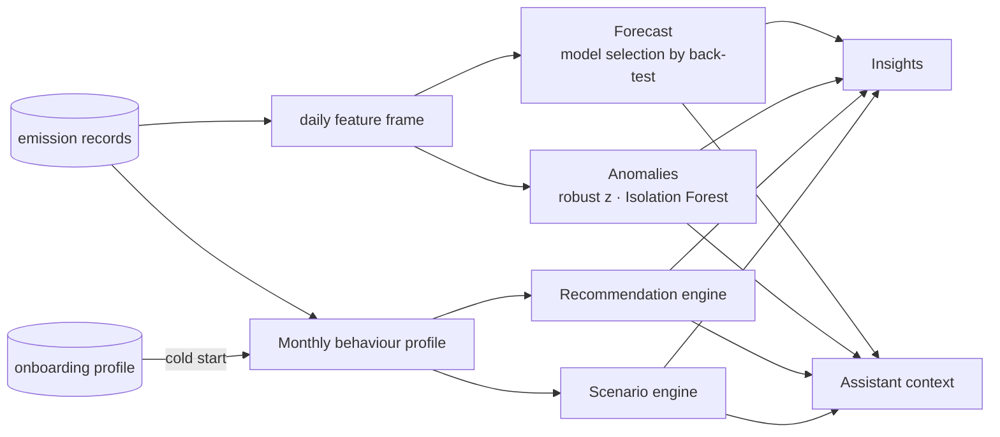

### Forecasting
Moving average, weekday-seasonal mean and a Ridge regression (trend + weekday, recency-weighted) are evaluated on the last
≤ 28 days; the lowest-MAE model forecasts 7–90 days. One-off spikes are capped for fitting; 80% intervals come from hold-out
residuals (bootstrap for totals). Needs ≥ 28 days with ≥ 10 active days, otherwise the API says so instead of guessing.

### Anomaly Detection
Per category, the last 7 days are compared with up to 12 prior weeks using median/MAD robust z-scores (z ≥ 2, ≥ 25% and ≥ 1 kg
above normal). A scikit-learn Isolation Forest flags unusual days, attributed to the category that deviated most.

### Recommendation Engine
Rules fire only for behaviour present in your data and price changes with real factors, e.g. *replace 2.0 car trips a week
(~78 km) with bus or train → 338 km/month × (0.1645 − 0.0687) kg/km*. Ranked by saving × difficulty weight; status is kept.

### Scenario Simulator
Eight levers modify your monthly behaviour profile; substitutions use the substitute's own factor (beef → vegetarian meal,
landfill → recycling, petrol km → EV km). The UI shows current, projected, reduction, percentage and each lever's isolated effect.

<p align="center">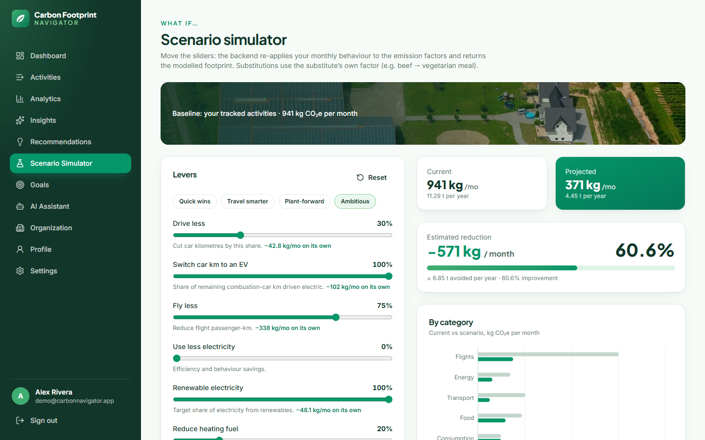</p>

### Sustainability Assistant
`User → Frontend → FastAPI → context builder → your emission data, insights, recommendations, scenario → LLM → response
validation → Frontend`. The LLM is told to use only numbers in the FACTS; a validator checks every kg/t/% figure in the answer
and flags anything it can't match. Without `AI_API_KEY` the assistant runs in a **labelled demo mode** that fills
intent-specific templates with the same computed facts. Details: [docs/ai-ml.md](docs/ai-ml.md).

## Database Architecture

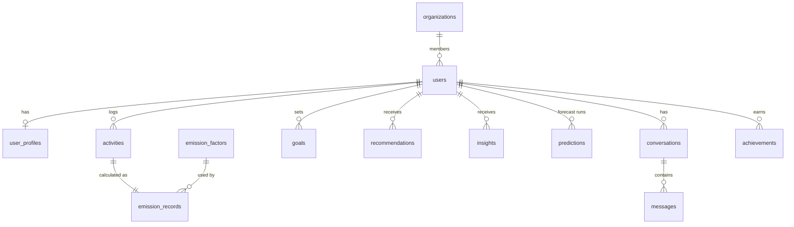

UUID keys, foreign keys with cascades, CHECK constraints, composite indexes for every analytics query, Alembic migrations.
See [docs/database.md](docs/database.md).

## API Architecture

58 REST endpoints under `/api` (auth, profile, activities, dashboard, emissions, emission-factors, forecast, anomalies, insights,
recommendations, scenarios, goals, achievements, assistant, organizations, health), Pydantic validation, pagination, filtering,
sorting and Swagger UI at `/docs`. See [docs/api.md](docs/api.md).

## Security

bcrypt password hashing · JWT with server-side revocation (token versions) · per-user data isolation (404 on foreign ids) ·
admin role checks · CORS allow-list · rate limiting on auth and assistant · env-only secrets with production checks · ORM-only SQL ·
non-root containers. See [docs/security.md](docs/security.md).

## Screenshots

All screenshots are real captures of the running app (Docker build) with the seeded demo account.

| Landing | Activity tracker |
|---|---|
| 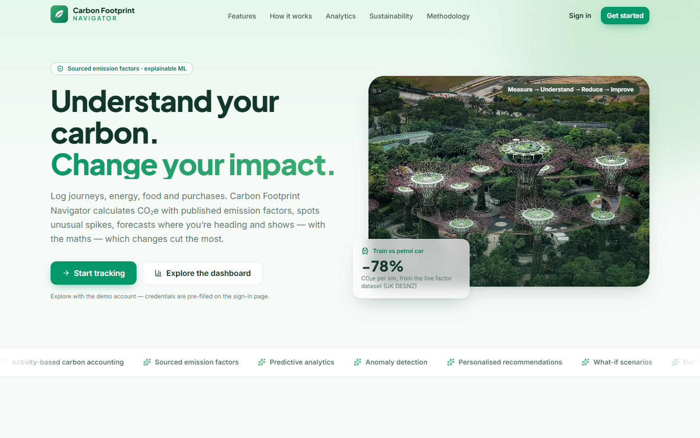 | 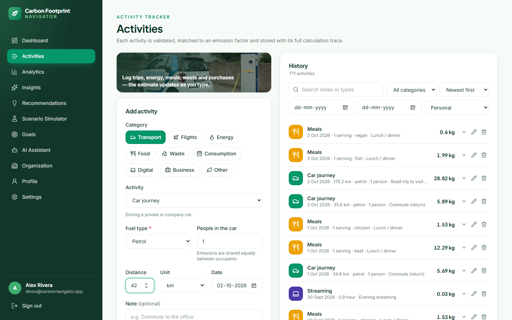 |
| **Recommendations** | **AI assistant (demo mode)** |
| 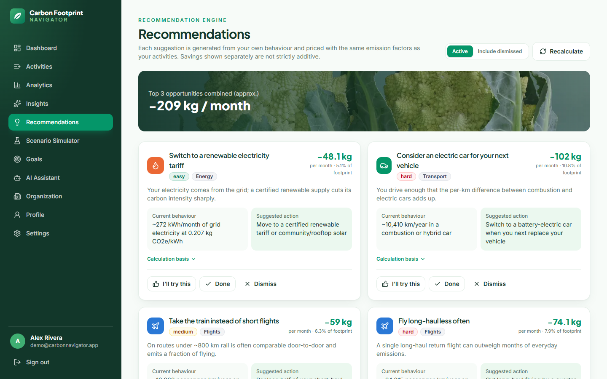 | 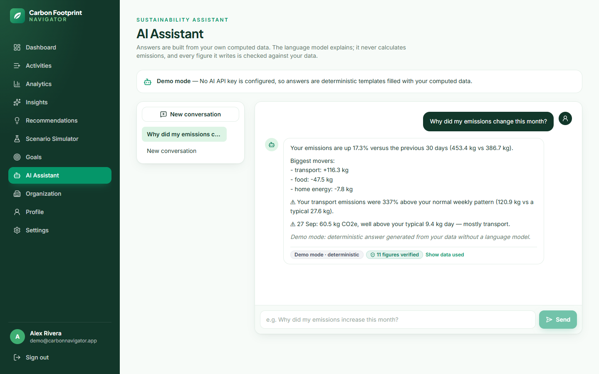 |
| **Goals & achievements** | **Insights** |
| 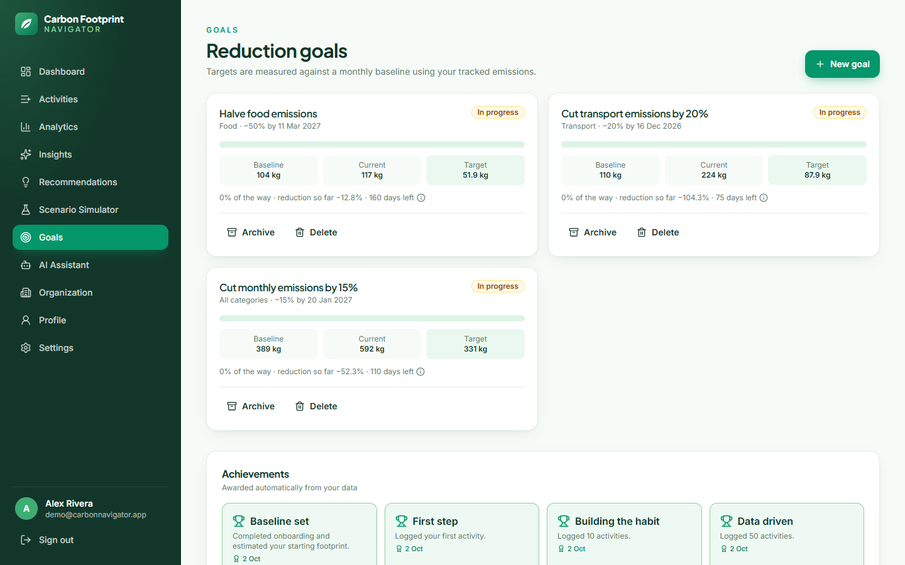 | 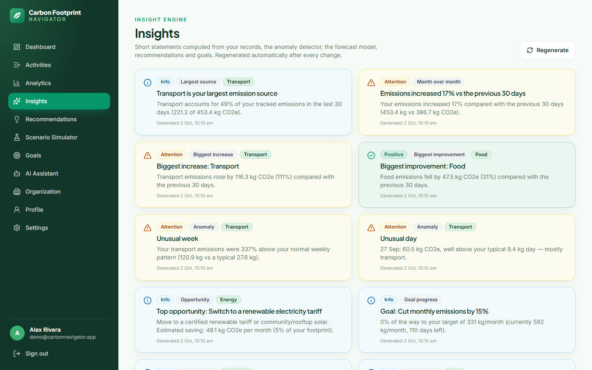 |
| **Methodology** | **Mobile** |
| 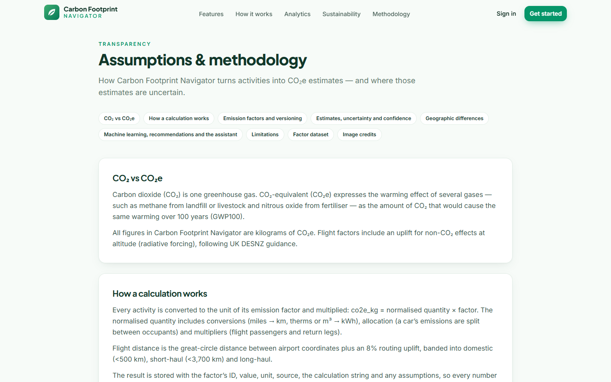 | 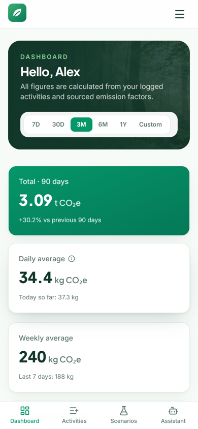 |

<details>
<summary>Analytics (full page)</summary>

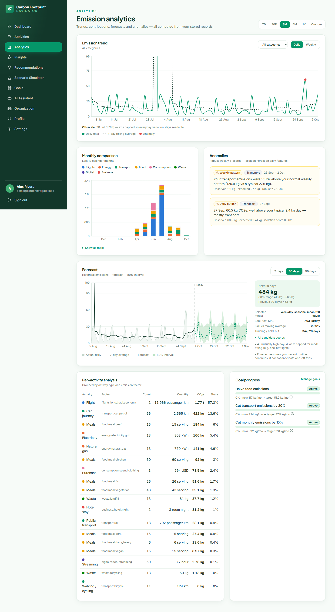
</details>

## Demo

There is no hosted demo yet. Run locally (below) and sign in with **`demo@carbonnavigator.app` / `DemoPass123!`** — about six
months of generated activities (commutes, meals, energy, flights, purchases) plus a recent road trip that the anomaly detector flags.

## Local Setup

Prerequisites: Python 3.12+, Node 22+, PostgreSQL 16 (or `docker compose up postgres`).

```bash
# Backend
cd backend
python -m venv .venv && source .venv/bin/activate      # Windows: .venv\Scripts\activate
pip install -r requirements-dev.txt
cp .env.example .env                                     # set DATABASE_URL, JWT_SECRET
alembic upgrade head
python -m app.seed --demo                                # factors + demo user
uvicorn app.main:app --reload                            # http://localhost:8000/docs

# Frontend (new terminal)
cd frontend
npm install
npm run dev                                              # http://localhost:5173 (proxies /api to :8000)
```

## Environment Variables

| Variable | Description |
|---|---|
| `DATABASE_URL` | PostgreSQL URL (`postgresql+psycopg://…`; `postgres://` is normalised) |
| `JWT_SECRET` | ≥ 32 random characters (enforced when `ENVIRONMENT=production`) |
| `CORS_ORIGINS` | Comma-separated allowed origins |
| `AI_PROVIDER` / `AI_API_KEY` / `AI_MODEL` | `anthropic` + key for LLM mode, `demo` otherwise; default model `claude-opus-5-5` |
| `SEED_EMISSION_FACTORS` / `SEED_DEMO_DATA` | Seeding on start |
| `VITE_API_URL` | Frontend build-time backend origin (empty = same-origin `/api`) |

Full list: [docs/deployment.md](docs/deployment.md). Only `.env.example` files with placeholders are committed.

## Docker Setup

```bash
cp .env.example .env          # optional
docker compose up --build
```

* App: http://localhost:8080 (nginx serves the SPA and proxies `/api`)
* API docs: http://localhost:8000/docs
* PostgreSQL data persists in the `pgdata` volume; all services have health checks.

## Testing

```bash
cd backend && pytest               # 70 tests on PostgreSQL (TEST_DATABASE_URL), schema built by Alembic
cd frontend && npm test            # 13 tests (Vitest + Testing Library)
cd frontend && npm run typecheck && npm run lint && npm run build
```

Backend tests cover authentication (hashing, expiry, forged and revoked tokens, rate limiting), authorisation and cross-user
isolation, the carbon engine (factor lookup, conversions, allocation, flights, invariants, catalogue coverage), activity CRUD,
dashboard maths, goals, organisations, insights, forecasting and anomaly detection on synthetic data, recommendations and scenarios
against factor arithmetic, the assistant (facts passed to the LLM, number validation, fallback) and versioned admin factor updates.
CI (`.github/workflows/ci.yml`) runs lint, migration drift check, backend tests on PostgreSQL, frontend checks and a Compose smoke test.

## Engineering Decisions

* **Deterministic accounting, ML for analysis, LLM for words.** Keeps every number reproducible and testable.
* **Activity + emission record split** with the invariant `co2e = normalized_quantity × factor`, which makes analytics, profiles
  and scenarios composable.
* **Versioned factors** instead of in-place edits, so historical results stay auditable.
* **Simple, explainable models** chosen by back-test rather than a heavyweight model that a sparse personal time series can't support.
* **Background refresh** after writes keeps the API fast while insights and recommendations stay current.
* **Catalogue-driven forms** — the frontend renders activity inputs from the backend catalogue, so validation rules live in one place.

## Challenges & Solutions

| Challenge | Solution |
|---|---|
| One flight dwarfs months of daily data in charts and models | Outlier capping for model fitting; charts cap the y-axis and list off-scale days with true values in tooltips |
| Extrapolating a single trip to a yearly habit | Infrequent activities (flights, purchases, hotels) are averaged over up to 365 days; routine ones over 90 |
| Cold start | Onboarding estimate with explicit assumptions until ≥ 14 days / 5 activities are tracked; forecasts and anomalies say when there isn't enough data |
| LLMs hallucinating numbers | FACTS-only prompt + post-hoc numeric validation + visible flags; deterministic demo mode as fallback |
| Circular FK (organisations ↔ users) in the first migration | Added the FK after both tables exist; verified upgrade/downgrade/upgrade and `alembic check` |

## Project Structure

```
carbon-footprint-navigator/
├── backend/
│   ├── app/
│   │   ├── api/            # routes + auth dependencies
│   │   ├── ai/             # context builder, prompts, provider, validation, demo responder
│   │   ├── carbon/         # engine, catalogue, units, flights, factors, behaviour, scenarios (+ data/)
│   │   ├── core/           # settings, security, rate limiting
│   │   ├── db/             # base + session
│   │   ├── ml/             # feature engineering, forecasting, anomalies, recommendations, evaluation
│   │   ├── models/         # SQLAlchemy models
│   │   ├── schemas/        # Pydantic schemas
│   │   ├── services/       # analytics, activities, insights, goals, achievements, organizations, seed, pipeline
│   │   ├── scripts/        # create_admin
│   │   ├── main.py · seed.py
│   ├── alembic/            # migrations
│   ├── tests/              # pytest (PostgreSQL)
│   └── Dockerfile · docker-entrypoint.sh · requirements*.txt
├── frontend/
│   ├── src/{api,animations,assets,charts,components,hooks,layouts,pages,test,types,utils}
│   ├── public/images/      # licensed photos (WebP)
│   └── Dockerfile · nginx.conf · vercel.json
├── docs/                   # architecture, methodology, AI/ML, database, API, security, deployment, images/
├── docker-compose.yml · render.yaml · .github/workflows/ci.yml
```

## Roadmap

- [ ] Hosted demo (Render + Vercel)
- [ ] CSV / bank-statement and utility-bill import with review step
- [ ] Market-based electricity accounting and time-of-use grid intensity
- [ ] Redis-backed rate limiting and a job queue for analytics refresh
- [ ] Organisation roles beyond owner/member and per-department reporting

## Future Improvements

* Expand regional factors (vehicles, waste, food) and add dataset-version selection per organisation.
* Probabilistic uncertainty per record (factor ranges) propagated to dashboard totals.
* Cookie-based sessions with CSRF protection instead of `localStorage` tokens.
* Dark mode using the validated dark-mode chart palette.

## Author

**Divyanshi** — 

Photography: Wikimedia Commons contributors under CC0 / CC BY / CC BY-SA / public domain — credits on the in-app Methodology page.
Licensed under the [MIT License](LICENSE).
