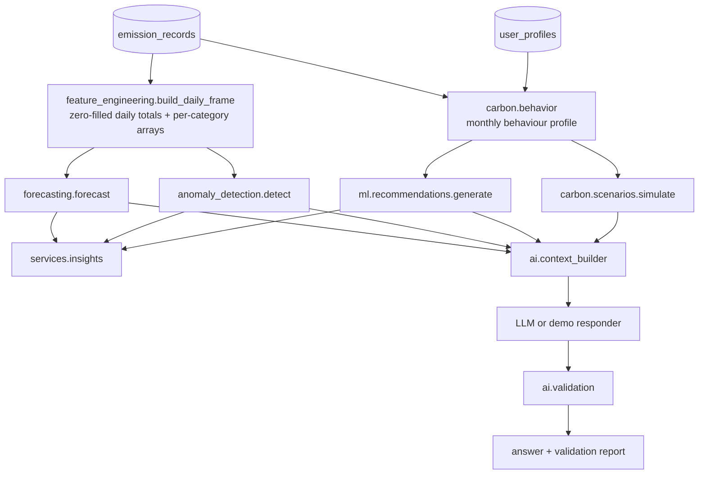

# AI / ML

The platform separates three kinds of computation:

| Kind | Where | Used for |
|---|---|---|
| Deterministic arithmetic | `app/carbon` | Every emission value, scenario and recommendation saving |
| Statistical / ML models | `app/ml` | Forecasting, anomaly detection, ranking recommendations |
| Language model (optional) | `app/ai` | Explaining computed facts in natural language |



## Forecasting (`app/ml/forecasting.py`)

* **Input**: zero-filled daily totals from the first record to today (max 365 days).
* **Pre-processing**: days above Q3 + 3·IQR are capped for fitting (one-off flights), and the number of capped days is reported.
* **Candidates**
  * `moving_average_28` — flat mean of the last 28 days (naive baseline)
  * `seasonal_weekday_28` — per-weekday means over the last 4 weeks
  * `ridge_trend_weekday` — scikit-learn `Ridge(alpha=1)` on `[trend, day-of-week one-hot]`, sample weights with a 60-day half-life, predictions clipped to `[0, 2 × recent mean]`
* **Model selection**: hold out the last `min(28, n/4)` days, fit each candidate on the rest, pick the lowest MAE.
  The response includes MAE, RMSE, sMAPE for every candidate, skill vs the moving average and the hold-out bias.
* **Intervals**: holdout residuals are centred (bias reported separately); daily 80% bands use their 10th/90th percentiles,
  and the horizon-total interval comes from a 2,000-path residual bootstrap.
* **Cold start**: fewer than 28 days of history or fewer than 10 active days → `insufficient_data` with an explanation.
* **Persistence**: each API forecast run is stored in `predictions` (last 20 kept) for auditability.
* **Limitations**: assumes the recent routine continues; cannot anticipate trips; residuals are assumed exchangeable.

## Anomaly detection (`app/ml/anomaly_detection.py`)

1. **Weekly robust z-score per category** — the last 7 days vs up to 12 previous 7-day blocks:
   `z = 0.6745 × (x − median) / MAD`. Flagged when `z ≥ 2`, ≥ 25% above normal and ≥ 1 kg above normal, and the category
   appears in at least 4 baseline weeks. Message: *"Your transport emissions were 337% above your normal weekly pattern (120.9 kg vs a typical 27.6 kg)."*
2. **Daily Isolation Forest** — features `[total, total − trailing 28-day median, per-category kg]`, standardised;
   `IsolationForest(n_estimators=200, contamination=0.04, random_state=42)`. Only upward spikes ≥ 1.5× the trailing median are
   reported, attributed to the category with the largest deviation. Requires ≥ 30 days and ≥ 10 active days.

Both are run on demand (`GET /api/anomalies`), feed insights, and mark points on the dashboard/analytics charts.

## Recommendation engine (`app/ml/recommendations.py`)

Rule-based and quantitative: each rule fires only when the behaviour exists in the user's profile and computes
`changed_quantity × (factor_current − factor_alternative)` with factors from the database. Rules cover car→public transport
(using the user's real trip count and average distance), trip chaining, EV switch, short flights→rail, long-haul reduction,
economy cabin, renewable tariff, electricity efficiency, thermostat, beef/lamb swaps, meat-free days, recycling, composting,
second-hand clothing and longer device life. Behavioural coefficients that are assumptions (15% trip chaining, 8% per °C,
30% food share of residual waste, 90% avoided production for second-hand) are written into `calculation_basis`.

Ranking: `priority = monthly_reduction_kg × difficulty_weight` (easy 1.0, medium 0.7, hard 0.45). Suggestions below 0.5 kg/month
are dropped. Regeneration preserves the user's status (accepted / dismissed / completed) per recommendation key.

## Scenario simulator (`app/carbon/scenarios.py`)

Levers (0–100%): drive less, EV adoption, fly less, use less electricity, renewable share, reduce heating fuel, replace meat,
recycle more. Levers apply to the behaviour profile in a fixed order and **substitute** rather than delete where relevant
(beef meals → vegetarian meals, landfill → recycling, petrol km → EV km, grid kWh → renewable kWh), each priced with the
substitute's own factor. The response includes current vs scenario totals by category and each lever's isolated effect.

## Sustainability assistant (`app/ai`)

```
User → Frontend → FastAPI → context_builder (DB + carbon engine + ML) → LLM → validation → Frontend
```

* **Context builder** detects intents (why-change, reduce, what-if, plan, biggest-source, forecast, explain) and topics, then
  assembles a FACTS object: 30-day totals and shares, previous 30 days, per-category change, top activities, anomalies,
  recommendations (with calculation bases), the forecast, goals, profile — and, for "what if…" questions, a scenario computed
  by the scenario engine from levers parsed out of the question (e.g. "reduce flights by 30%").
* **Provider** — `AI_PROVIDER=anthropic` with `AI_API_KEY` uses the official `anthropic` SDK (default model `claude-opus-5-5`,
  low effort, server-side refusal fallback). The key lives only on the server; the browser never calls the LLM.
* **Prompt** — instructs the model to use only numbers present in FACTS and never to calculate new ones.
* **Validation** — every number attached to kg / t / % in the answer is matched against all numbers in FACTS (and the question),
  allowing for rounding and kg↔t conversion. Unverified figures are listed in the response, flagged in the UI and appended as a caution.
* **Demo mode** — with no key (or if the provider errors) a deterministic responder fills intent-specific templates with the
  same FACTS. It is labelled "Demo mode · deterministic" everywhere; it is not presented as AI.
* Every assistant message stores the facts it used and its validation result; the UI exposes them via "Show data used".

## Evaluation

* Forecast metrics are computed live per user (hold-out MAE/RMSE/sMAPE, skill vs naive) and shown on the Analytics page.
* `backend/tests/test_ml.py` checks behaviour on synthetic data with known structure: weekly seasonality is learned and beats the
  naive baseline, intervals bracket predictions, outlier capping works, the weekly detector reports the correct percentage, stable
  series produce no anomalies and the Isolation Forest finds an injected spike.
* There is no offline benchmark dataset of real user footprints, so no population-level accuracy claim is made.
