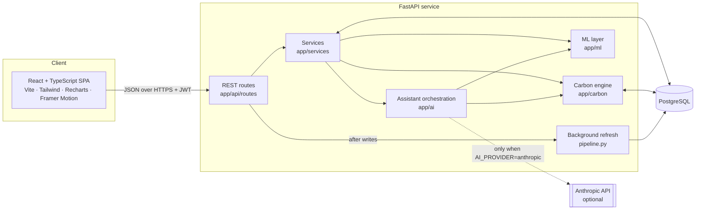
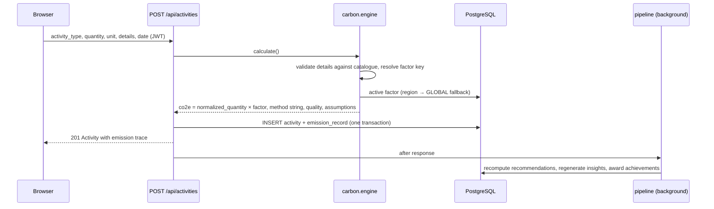

# Architecture

Carbon Footprint Navigator is a three-tier application: a React SPA, a FastAPI service and PostgreSQL.
The design rule throughout is **deterministic accounting, ML for analysis, LLM for explanation only**.

## Layers (backend/app)

| Package | Responsibility |
|---|---|
| `api/` | HTTP concerns only: routing, auth dependencies (`deps.py`), status codes, request/response schemas. |
| `schemas/` | Pydantic v2 request/response models and validation rules. |
| `models/` | SQLAlchemy 2.0 ORM models (`user.py`, `carbon.py`, `engagement.py`). |
| `carbon/` | Deterministic carbon accounting: unit conversion, flight distance, activity catalogue/classification, factor repository, calculation engine, behaviour profiles, scenario engine. No ML, no LLM. |
| `ml/` | Feature engineering, forecasting, anomaly detection, recommendation engine, evaluation metrics. Pure functions over numpy arrays / behaviour profiles. |
| `ai/` | Context builder, prompts, provider adapter, numeric validation, deterministic demo responder, assistant orchestration. |
| `services/` | Use-cases that combine the above with the database: activities, analytics, insights, goals, achievements, organizations, seeding, post-write pipeline. |
| `core/` | Settings (env vars), password hashing + JWT, rate limiting. |
| `db/` | Declarative base with naming conventions, session factory. |

## Request flow: logging an activity

The frontend invalidates every derived query (dashboard, analytics, forecast, goals…) after a write and
re-fetches insights/recommendations again shortly after, because those are regenerated by the background task.

## Frontend (frontend/src)

| Folder | Contents |
|---|---|
| `api/` | `client.ts` (fetch wrapper, token, typed `ApiError`, session-expiry event), `endpoints.ts` (typed calls). |
| `types/` | TypeScript mirrors of the backend schemas. |
| `hooks/` | `useAuth` (context), `useFactors`, `useDebounce`, `useInvalidateEmissions`. |
| `layouts/` | Public layout (navbar/footer) and app layout (sidebar, mobile drawer + bottom nav, error boundary). |
| `pages/` | One lazily-loaded component per route. |
| `components/` | UI primitives (`ui/`), dashboard cards, activity form, landing sections, profile field config. |
| `charts/` | Recharts components sharing tooltip/legend/axis conventions and the validated category palette. |
| `assets/images.ts` | Central image registry with licence metadata. |

Server state is managed with TanStack Query; there is no global client store beyond the auth context.
Routes other than the landing page are code-split, and Recharts loads only on pages with charts.

## Key design decisions

* **Activity vs emission record** — the activity is what the user said; the record is the calculation with a full audit trail
  (factor id/value/unit/source, method string, assumptions, data quality). Recalculation on edit replaces the record.
* **Invariant** — `co2e_kg == normalized_quantity × factor_value` holds for every record, which makes analytics,
  behaviour profiles and scenarios composable (and is enforced by a test).
* **Versioned factors** — factor updates insert version N+1 and retire the old row, so historical records stay traceable.
* **Background analytics** — insight and recommendation regeneration runs after the response (FastAPI `BackgroundTasks`)
  with its own DB session, keeping write latency low. For multi-instance deployments this would move to a job queue.
* **Organization scope** — records carry an optional `organization_id`. Personal analytics exclude organization records;
  the organization dashboard includes only them.
