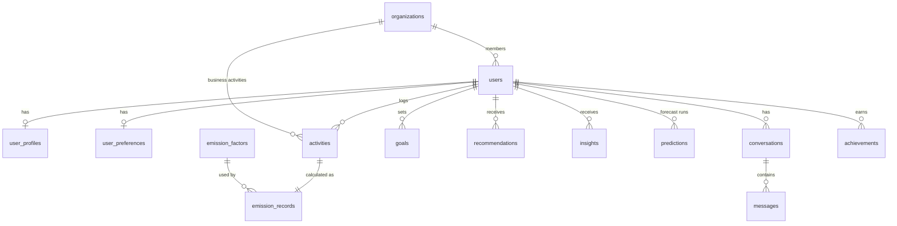

# Database

PostgreSQL 16, accessed through SQLAlchemy 2.0 (psycopg 3 driver). The schema is managed by Alembic
(`backend/alembic/versions/0001_initial_schema.py`), with deterministic constraint names from a naming convention.
All primary keys are UUIDs (no enumerable ids). Timestamps are timezone-aware.



| Table | Purpose | Notable constraints / indexes |
|---|---|---|
| `users` | Accounts: email (unique), bcrypt hash, role (`user`/`admin`), `token_version` for revocation, organization membership | CHECK role, CHECK org_role, index on email & organization_id |
| `user_profiles` | Onboarding answers (all nullable) | CHECK household size 1–20, renewable share 0–100 |
| `user_preferences` | Distance unit, default dashboard range | CHECK enums |
| `organizations` | Company workspace with join code | unique join_code |
| `emission_factors` | Versioned factor dataset | unique (key, region, version); index (key, region, is_active); CHECK category, value ≥ 0, quality |
| `activities` | What the user did (type, quantity, unit, date, JSON details) | index (user_id, occurred_on); CHECK quantity ≥ 0, category |
| `emission_records` | Calculation result + audit trail (factor id/value/unit/source, method, assumptions, quality) | unique activity_id; indexes (user_id, occurred_on), (user_id, category, occurred_on), (organization_id, occurred_on) |
| `goals` | Reduction targets vs a monthly baseline | CHECK reduction 0–100, status enum |
| `recommendations` | Generated suggestions + user status | unique (user_id, rec_key) |
| `insights` | Latest generated insights | index (user_id, generated_at) |
| `predictions` | Persisted forecast runs (model, metrics, points) | index (user_id, generated_at) |
| `conversations`, `messages` | Assistant history incl. facts used and validation result | index (conversation_id, created_at) |
| `achievements` | Awarded badges | unique (user_id, code) |

`emission_records` denormalises `user_id`, `organization_id`, `category`, `activity_type` and `occurred_on` from the activity
so that every analytics query is a single indexed aggregate (`GROUP BY occurred_on, category`) with no joins.

## Data isolation

Every user-owned query filters by the authenticated user's id (`Scope(user_id=…)` in analytics; ownership checks returning
**404** for other users' rows so ids cannot be probed). Organization data is only reachable through the caller's own
`organization_id`. Isolation is covered by `tests/test_activities_and_isolation.py`.

## Migrations

```bash
cd backend
alembic upgrade head          # apply
alembic downgrade base        # roll back
alembic revision --autogenerate -m "describe change"   # after editing models
alembic check                 # CI: fails if models and migrations drift
```

The initial migration was autogenerated and hand-adjusted for the `organizations ↔ users` circular foreign key (added with
`create_foreign_key` after both tables exist). Upgrade → downgrade → upgrade and `alembic check` were verified on PostgreSQL 16.

## Seeding

`python -m app.seed` seeds the 75 emission factors (idempotent; never overwrites edited/versioned factors) and, when
`SEED_DEMO_DATA=true` or `--demo`, a demo user with ~6 months of generated activities. Demo activities are generated as
*behaviour* (trips, meals, meter readings, flights) and pass through the normal calculation engine; goal baselines are computed
from the demo user's own data.
